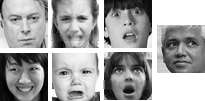
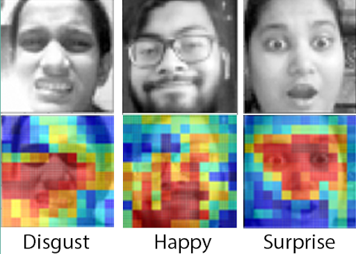
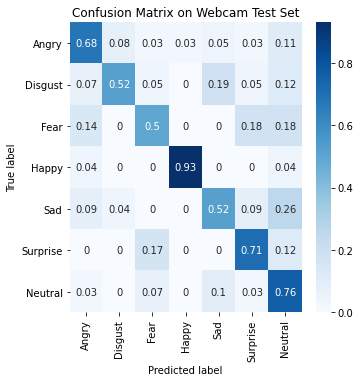
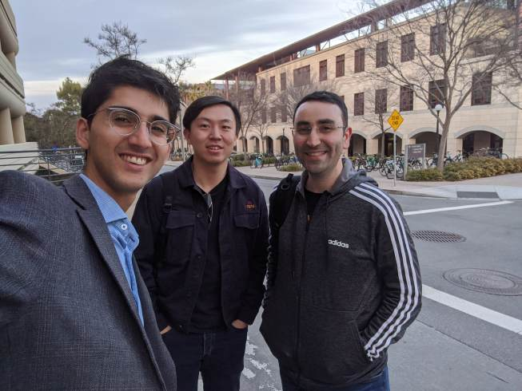

# Facial Expression Recognition

## Research Paper
Our published paper can be found here: https://arxiv.org/abs/2004.11823

## Mobile App
Our mobile app can be accessed here: http://cs230-fer.firebaseapp.com/  
Note: you may run into permission issues with iPhones on the Safari browser

## Introduction
Facial expressions are a universal way for people to communicate. This repository demonstrates several deep learning models for detecting emotions, including a five-layer convolutional network and transfer learning models.

We demonstrate a state-of-the-art accuracy of **75.8%** on our best model, outperforming the highest reported 75.2% test accuracy in published works at the time of this writing [\[1\]](https://arxiv.org/abs/1612.02903).

Additionally, we apply our FER models to the real world with an on-device, real-time mobile web app.

## Getting Started
The included Jupyter notebooks have all pre-requisities defined internally. 

1. Refer to our paper for implementation details and poster/video for a high-level overview.
2. Download datasets as described in [datasets/README.md](datasets/README.md).
3. Run one of the Jupyter notebooks in the top-level directory

## Intepretability

### Occlusion-based Saliency Maps
Our web app model learned to focus on the mouth and nose to make predictions for disgust, mouth for happiness, and eyes and nose for surprise. For neutral images, it focused on all parts of the face except for the nose, which made sense given that small changes in non-nose regions tend to correspond to emotion changes.

### Confusion Matrix
The highest misclassifications on our model were of true sad images predicted as neutral. To address this, we can further augment our web app training dataset with more properly labeled sad images.

## Video

## Background
This was our final project for [CS230 Deep Learning](https://cs230.stanford.edu/syllabus/) at Stanford.

## Acknowledgements
### NED University
The mobile web application development was led by Assistant Professor Asma Khan and her team of undergraduate students in the [Software Engineering department](https://se.neduet.edu.pk/) of NED University in Karachi, Pakistan.
[Muhammad Bilal Khan](https://www.linkedin.com/in/bilal-khan-a54651150/) (app/hosting), [Muhammad Hassan-ur-Rehman](https://www.linkedin.com/in/muhammad-hassan-ur-rehman-32118a13a/) (app/hosting), and [Tooba Ali](https://www.linkedin.com/in/tooba-ali-75243319a/) (UI design). [Muhammad Ashhad Bin Kashif](https://www.linkedin.com/in/ashhad-kashif-0b21a517b/) and [Summaiya Sarfaraz](https://www.linkedin.com/in/summaiya-sarfaraz-b19b1a177/) assisted with network interpretability. [Muhammad Hasham Khalid](https://www.linkedin.com/in/muhammad-hasham-61724018b/) and [Midha Tahir](https://www.linkedin.com/in/midhatahir1999/) worked on auxiliary dataset preparation, error analysis, and model tuning for the web app.
